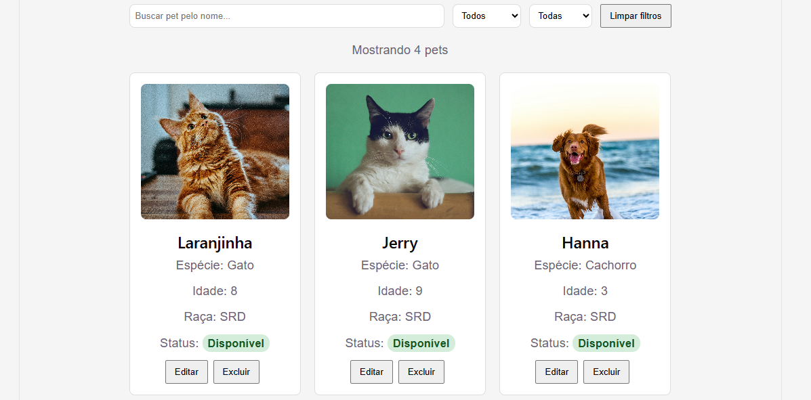

# Pet Adoption Platform



Full stack web application for pet adoption management, developed for study and portfolio purposes.

## Features

* Pet registration, listing, update and deletion (CRUD)
* Search pets by name
* Filter pets by status and species
* Upload and update pet images
* Pet adoption status management
* Responsive interface for desktop and mobile devices
* Real-time feedback messages for user actions
* Loading indicators during data fetching
* MongoDB Atlas integration
* Mongoose model validation
* RESTful API with Express
* Centralized error handling middleware
* Modular architecture with controllers, routes and services

## Technologies

### Front-end

* React
* Vite
* JavaScript
* CSS

### Back-end

* Node.js
* Express
* MongoDB Atlas
* Mongoose
* Multer
* Dotenv
* Nodemon

## Deploy

- Frontend: https://pet-adoption-platform-nine.vercel.app
- Backend API: https://pet-adoption-platform-tz77.onrender.com

> Note: The backend is hosted on Render's free tier. If the service is inactive, the first request may take a few seconds to respond.

## Environment Variables

Create a `.env` file based on `.env.example`.

Example:

```
MONGO_URI=<mongodb_connection_string>
PORT=3000
```

## Installation

Install the dependencies for both the backend and frontend:

```
npm install
```

## Run Project

Start the backend:

```
npm run dev
```

Then start the frontend (inside the `frontend` folder):

```
npm run dev
```

## Planned Features

* User authentication
* Automated tests
* Docker containerization
* CI/CD with GitHub Actions
* Cloud image storage
* Application deployment

Project under development.
